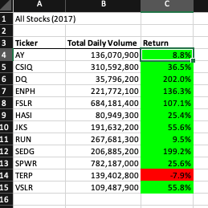
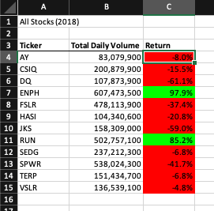

# Analysis of 2017 / 2018 stocks

Measuring the gains/losses of investments in my stock portfolio

Results

| 2017      | 2018 |
| ----------- | ----------- |
|       |        |

In 2017 we had significantly more gains that losses than in 2018.  In 2018 nearly the entire stock portfolio displayed signficant loss.

Summary:

What are the advantages or disadvantages of refactoring code?

Often when refactoring code, you can reduce complexity while making the code easier to read.  This makes the code easier to maintain over time and therefore makes the code less expensive over time.  While all of that is adventageous, the disadvantage is the investment of time needed in order to clean up / improve code.  Touching code that "works" also comes with the cost of introducing uncertainty whether it is your fixes or the old code that is leading to problems today.

How do the pros and cons apply to refactoring the original VBA script?
Honestly the original script was way to verbose with comments.  Good code should be readible on it's own without disrupting the flow of reading through the code.  Variables should be named, functions should be written, and logic should be presented in such a manner that tells the story of the code.  If something novel is introduced (or too much cleverness is provided) maybe a comment is needed to explain, but otherwise the code should be allowed to speak for itself.
